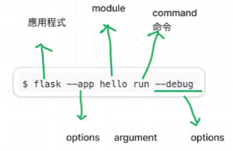

## 網頁製作

### 課程參考網址如下:

### 1. Jinja2

[Jinja2參考網址](https://jinja.palletsprojects.com/en/3.1.x/templates/)

### 2. Flask

[Flask參考網址](https://flask.palletsprojects.com/en/3.0.x/)

------

#### 執行指令

------

## 完成網頁網址
[網址連結](https://clare-window.onrender.com/)

## pgAdmin連線 (帳號/密碼/網址)
--postgresql://--

--tvdi_****_user:--

--MVXOacNc7LvzZSZ****4LKO6s9ZhGsto@--

--dpgcpscsal6l47c73e3****-a.singapore-postgres.render.com/--

--tvdi_****--

