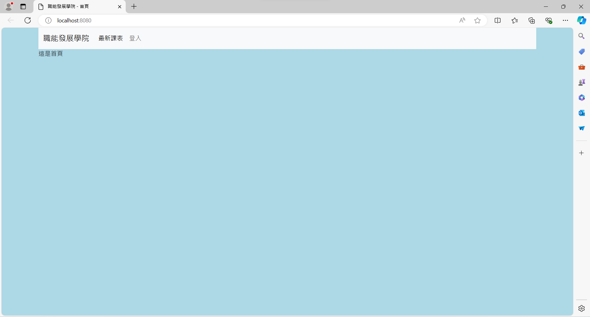

## 網頁製作 (增加cookies)

### 課程參考網址如下:

### 1. Jinja2

[Jinja2參考網址](https://jinja.palletsprojects.com/en/3.1.x/templates/)

### 2. Flask

[Flask參考網址](https://flask.palletsprojects.com/en/3.0.x/)

### 3. dash

[dash參考網址](https://dash.plotly.com/python)

------
### 網頁頁面如下:

